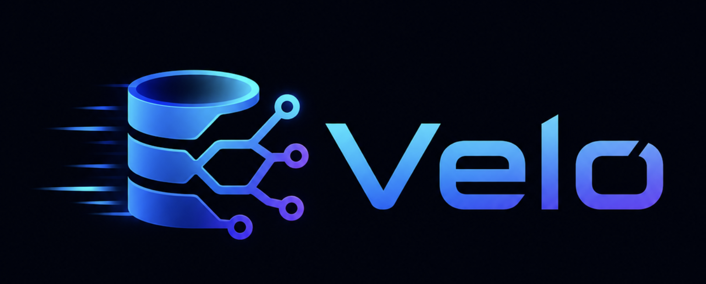

<p align="center">
  
</p>

# Velo

Web-first Postgres branching.

Velo runs a small self-hosted control plane for production Postgres, backups, PITR, and disposable dev branches.

## Model

- Production Postgres runs on a prod server.
- Velo web UI runs on a dev/control server.
- Production uses pgBackRest backups and PITR.
- Dev branches run as Docker Postgres containers on ZFS copy-on-write datasets.
- Production is special, but appears beside branches in the UI.

## Requirements

- Ubuntu/Debian dev server
- Ubuntu/Debian prod server
- SSH access from dev to prod
- Bun
- Docker
- ZFS
- PostgreSQL client tools
- pgBackRest

## Install

Use [`install.md`](install.md). Give that file to an AI coding agent with access to two fresh Ubuntu/Debian servers.

The agent installs Velo end-to-end:

- installs system packages
- clones this repo
- creates the Velo web service
- configures production Postgres and pgBackRest
- creates the dev replica base
- verifies readiness with `/healthz?ready=1`

When the agent finishes, Velo is ready at:

Open:

```text
http://<dev-server-ip>:3000
```

## Development

```bash
bun install
bun run db:migrate
bun run dev
```

### Local Docker Loop

For fast local product work without Hetzner:

```bash
bun run local:reset
bun run local:dev
```

Open:

```text
http://localhost:3000
```

This starts:

- local prod Postgres on `localhost:55432`
- local dev Postgres on `localhost:55433`
- local MinIO on `localhost:59000`
- local SQLite at `.velo/local-docker.sqlite`
- real pgBackRest backups and WAL archive to MinIO

Local Docker is prod-like for backup and PITR work. It creates a pgBackRest stanza, checks WAL archiving, runs a full backup, and runs each local branch as its own Postgres container with source data copied by `pg_dump`. Branch connection strings point at the Go TCP proxy, which wakes stopped branches and stops idle ones. It still does not prove SSH, systemd, Hetzner networking, R2, or ZFS COW. Use remote dev before merging infra-sensitive work.

Each git branch gets one local environment by default. Ports are assigned once and stored in `.velo/local/<branch>/env`, so multiple branches can run on the same computer without port collisions.

Useful local stack commands:

```bash
bun run local:up
bun run local:status
bun run local:down
```

`bun run local:dev` starts the proxy. For a manual stack, start the web app, then run:

```bash
set -a; source .velo/local/<instance>/env; set +a
VELO_INTERNAL_API_URL=http://127.0.0.1:$VELO_LOCAL_WEB_PORT/internal bun run proxy
```

Useful checks:

```bash
bun run typecheck
bun run test
bun run web:build
bash -n scripts/*.sh
scripts/test-release-artifact.sh
scripts/test-update-flow.sh
scripts/test-release-upgrade-flow.sh
```

## Releases

Releases are made by GitHub Actions:

```bash
gh workflow run release.yml -f version=patch
```

The workflow validates the bump, builds and tests Velo, generates release notes, creates `velo-vX.Y.Z.tar.gz`, smoke-tests update/install paths, tags the release, and uploads the artifact.

## Test Deploy

```bash
VELO_DEPLOY_DEV_HOST=157.180.22.136 \
VELO_DEPLOY_PROD_HOST=89.167.89.255 \
VELO_DEPLOY_USER=root \
VELO_DEPLOY_KEY=$HOME/.ssh/frost-e2e-ci \
bun run deploy
```

This resets the Hetzner app and database state, installs Velo, bootstraps Postgres and pgBackRest, and starts `velo-web`.

Remote Vite loop:

```bash
VELO_REMOTE_HOST=157.180.22.136 bun run remote:dev
VELO_REMOTE_HOST=157.180.22.136 bun run remote:sync
```

## Repo Shape

```text
src/db        SQLite schema, migrations, generated DB types
src/server    tRPC routers, jobs, setup, branch, restore services
src/web       TanStack Start UI
src/managers  Docker, ZFS, WAL, cert adapters
src/utils     small shared helpers
scripts       deploy, remote dev, cleanup
```

## Notes

Velo v2 is web only. There is no CLI entrypoint, no npm binary, and no JSON state engine. Local state lives in SQLite at `.velo/velo.sqlite`. It contains operational secrets, so keep `.velo` private.
